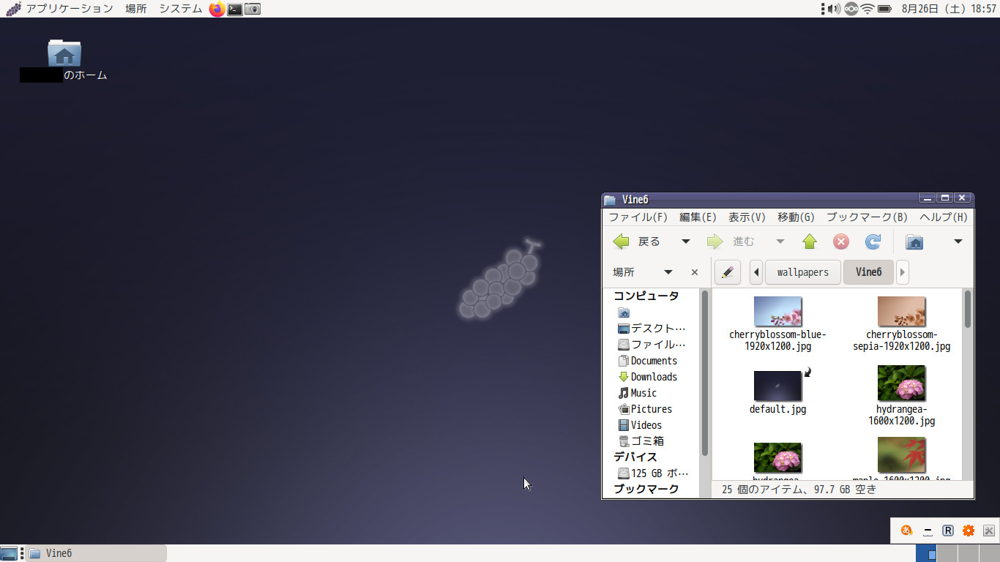
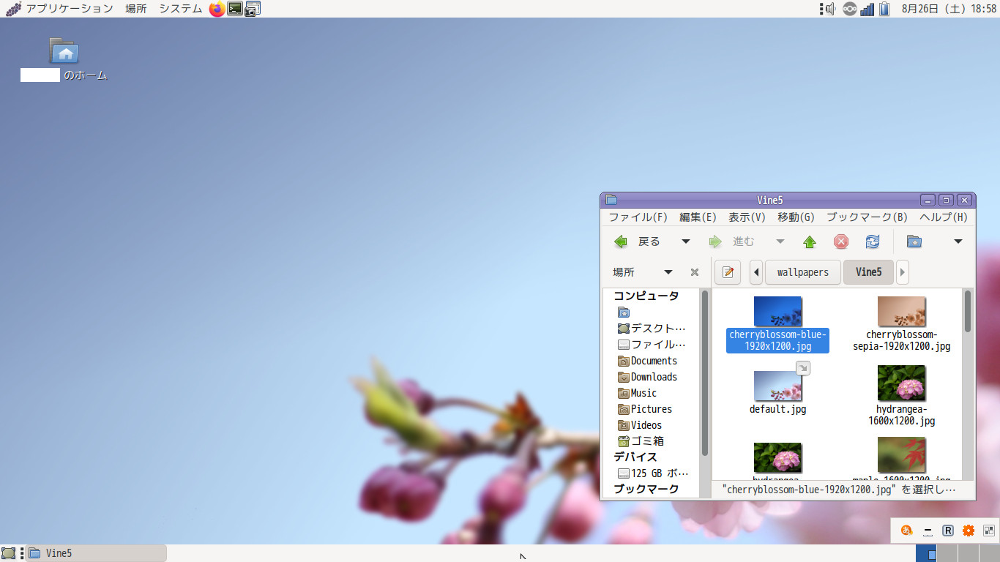
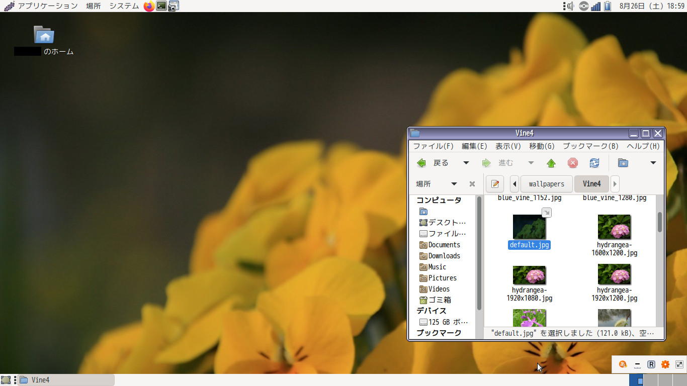
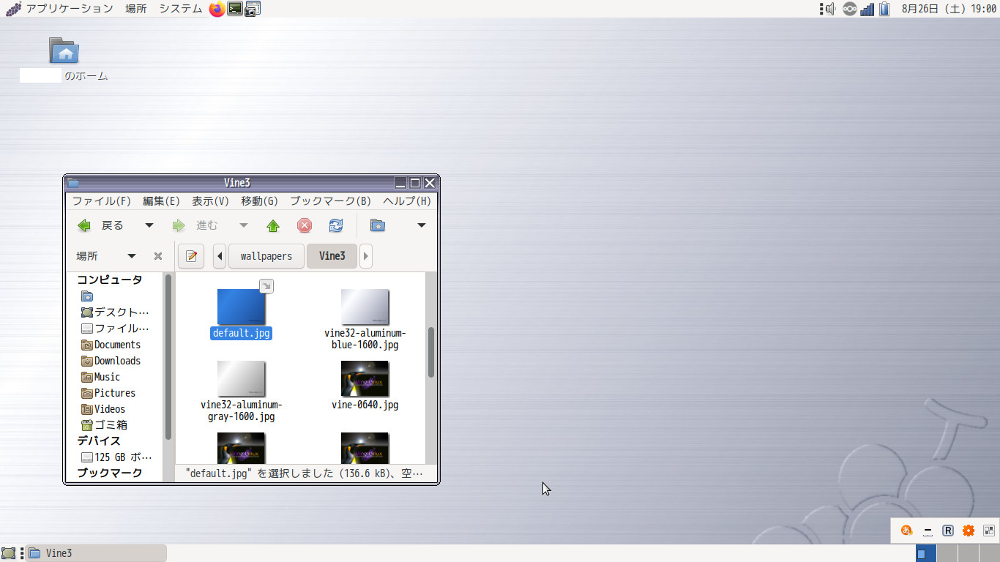
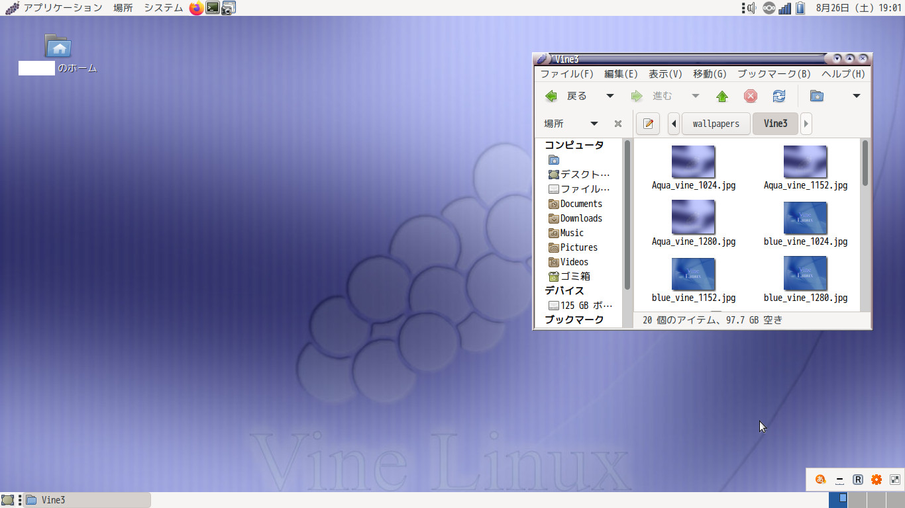

Vine Linux Theme Patcher
==================================
Vine Linuxのテーマを現代のMATEで利用するための、ダウンロードとパッチ当てを行うスクリプトです。
以下はDebian 12(Bookworm)のMATE環境におけるスクリーンショットです。







使い方
----------------------------------
Linux環境にて、以下の手順に従ってください。

必要なパッケージのインストール。Debian/Ubuntu環境では以下のとおりです。
```
sudo apt update
sudo apt install wget rpm2cpio
```

任意のディレクトリで、スクリプトを実行してください。
```
./download_and_patch_all.sh
```

カレントディレクトリ以下にOutディレクトリが生成されます。この中に展開・パッチされたテーマとアイコン、壁紙が保存されます。

./Out/iconsの中身を~/.iconsに、./Out/themesの中身を~/.themesに移動し、MATEの「外観」設定からテーマの変更を行ってください。

お好みで、VLフォントの適用も行うとよりVine Linuxらしくなります。VLフォントは[公式サイト](http://vlgothic.dicey.org/)か、Linuxディストリビューションによっては公式リポジトリに含まれています。


動作確認環境
----------------------------------
* Debian 12.1 Bookworm
    * MATE 1.26.0

行ったこと
----------------------------------
Vine Linuxのテーマはアイコン、Metacityテーマ、GTK2テーマから成り立っています。MATE環境ではGTKはすでに3に移行してしまっているため、GTK2テーマは現在では利用ができません。
このため、GTK部分はVine Linuxのテーマが元にしていて、現在でもメンテナンスされているClearlooksを代替として使用するように変更しました。
MetacityテーマはMATEでほぼそのまま利用できましたが、一部GTK2のテーマのカラースキームを参照している箇所がありその部分が動作していなかったため、定数を直接Metacityテーマの中に書くようにしました。


注意事項
----------------------------------
* テーマ・アイコン名などは、バージョン間で混じらないよう、バージョンの数字を後に付与しました。
* アイコンは、Vine Linux 3,4のものは取り出しはできましたが今のところ正常動作できていません。
    * Vine Linux 3,4のテーマを選んだ場合、外観のカスタマイズからアイコンのみ他のものに変更していただくようお願いいたします。
* Vine Linux 2.x風のウィンドウ枠を使用したい場合には、外観のカスタマイズからウィンドウ枠の変更を行ってください。
* 本スクリプトは非公式のものとなります。テーマ・アイコン・壁紙の著作権は開発元のProject Vineにありますので、個人的に楽しむことを超えた利用はお控えください。このリポジトリには元の著作物は一切含めておりません。
